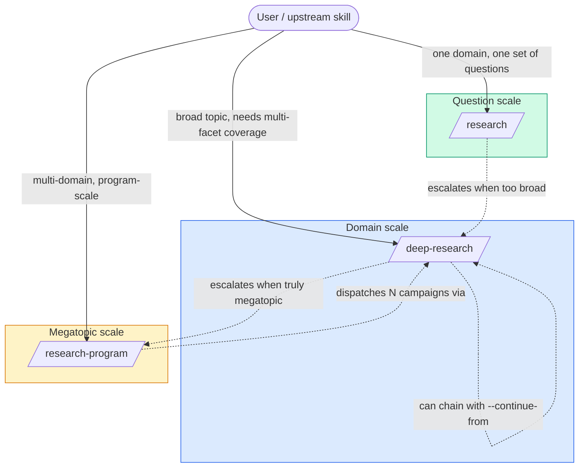

# Research Skills Overview

*Last updated: 2026-04-15*

> The three research skills (`/research`, `/deep-research`, `/research-program`) are a single architectural pattern applied at three scales. This doc is the unifying view. For scale-specific detail, see each skill's own architecture doc.

## The Fractal Pattern

Every research skill is built from the same four roles: an **Orchestrator** that decomposes and dispatches, **Workers** that investigate in parallel with isolated contexts, a **Synthesizer** that reconciles their outputs, and an **Evaluator** that judges quality independently. What changes across scales is what each role orchestrates and how much is delegated.

```
                  Orchestrator (Opus)
                        ↓
          ┌─────────────┴─────────────┐
          │  decompose → dispatch     │
          └─────────────┬─────────────┘
                        ↓
          Workers (Sonnet, N parallel, isolated)
                        ↓
                  Synthesizer (Opus)
                        ↓
                  Evaluator (Opus, isolated)
                        ↓
                     Output
```

The pattern is recursive-by-scale, not recursive-by-dispatch: we don't nest workers indefinitely. We lift the whole pattern to a higher scale when the problem exceeds the current one.

## Three Scales

| Scale | Skill | Orchestrator | Workers | Unit of Output | Cost |
|-------|-------|-------------|---------|---------------|------|
| **Question** | `/research` | Researcher (Opus, parent) | Sub-agents (Sonnet) × 3-5 | One domain brief + reference skill | ~$3-5 |
| **Domain** | `/deep-research` | Lead (Opus, parent) | Specialists (Sonnet) × 5-7 | Campaign directory (parent + N briefs + quality report) | ~$6-15 |
| **Megatopic** | `/research-program` | Planner (Opus, parent) | Campaigns (single-agent Opus research*) × 3-7 | Program directory (program plan + super-parent + N campaigns + program evaluation) | ~$35-75 |

Each scale's workers are the scale below's full output. That's the fractal: campaigns contain specialists, specialists contain sub-questions, sub-questions contain claims.

*\*Known limitation: nested agent spawning is currently blocked — campaign Leads cannot spawn their own Sonnet specialists. Campaigns execute as single-agent Opus research. Quality is strong (first program: 0.86 coverage, 4.2/5 coherence) but the four-role tree doesn't execute inside spawned agents. See [research-program-architecture.md §Campaigns](research-program-architecture.md) for details.*

## Scale Signals — When To Use Which

Match scale to topic shape, not to ambition.

### Use `/research` when

- The topic is one domain, one cluster of questions
- You can name the research questions upfront
- Expected output is a single brief + reference skill
- 3-5 parallel sub-questions fully cover the topic

*Signal: "I need to understand X before designing Y."*

### Use `/deep-research` when

- The topic spans 5+ orthogonal facets (not just questions)
- Decomposition itself is part of the research — you don't know the right cut yet
- Multi-angle synthesis matters (themes across perspectives, not answers to one question)
- Expected output is a cross-referenced brief set, not a single brief

*Signal: "This topic is big enough that I don't trust a single-agent pass to structure it well."*

### Use `/research-program` when

- The topic spans multiple domains, each itself big enough to be its own campaign
- 3-7 campaigns' worth of material
- Cross-domain themes and contradictions matter (not just within-domain)
- Expected output is a coordinated research body, not a single campaign

*Signal: "This is a multi-campaign effort — if I tried to fit it in one `/deep-research` I'd either hit the depth ceiling or produce superficial coverage across domains."*

### Rough upper-bound rule

If the topic would require more than 7 specialists, more than depth 4, or span multiple genuinely distinct domains — you've outgrown `/deep-research`. Lift to `/research-program`. Similarly, if a `/research` topic would need more than 5 sub-questions or spans orthogonal facets, lift to `/deep-research`.

Conversely, if you think you need `/research-program` but the megatopic decomposes into fewer than 3 campaigns, it's probably one `/deep-research` campaign in disguise.

## Composition Points

Four places the three skills connect:

### 1. Escalation (upward)

`/research` can surface during its scope phase that the topic is genuinely broader than it looked. It suggests `/deep-research` and the user decides. Similarly, `/deep-research` can recognize during decomposition that the seed is a megatopic and suggest `/research-program`.

Escalation is always user-gated. Never silent.

### 2. Reuse (downward through citations)

Every skill at every scale does a knowledge-index check in Phase 1. If an existing brief, campaign, or program covers part of the current scope, the skill cites it rather than re-running. This is the primary mechanism that keeps the knowledge layer from bloating.

### 3. Chain (within `/deep-research`)

When a `/deep-research` campaign's output reveals that one leaf turned out to be its own domain, the user can extend with:

```
/deep-research <leaf-topic> --continue-from <parent-campaign-dir>
```

This loads the parent campaign as priors, scopes decomposition to the leaf, writes typed cross-references back to the parent brief, and updates the parent campaign's `parent.md` with a pointer to the child. The chain is user-triggered; the linkage bookkeeping is automatic.

A sequence of chained `/deep-research` runs is an informal program. If more than two links are needed — or if the chain structure is known upfront — lift to `/research-program`, which formalizes the same pattern with a meta-plan, cross-campaign synthesis, and program-level evaluation.

### 4. Dispatch (within `/research-program`)

A program's campaigns are full `/deep-research` runs. The Program Planner spawns an Opus agent per campaign with a prompt that follows `/deep-research`'s workflow. Each campaign is autonomous in its decomposition and dispatch, but the Planner coordinates ordering, shares priors sequentially when campaigns depend on each other, and spawns a cross-campaign synthesizer + program evaluator after all campaigns complete.



## Context Isolation, Unified

Isolation rules are identical at every scale. Only the specifics of "what each role sees" shift with the unit of work:

| Role | What it sees | What it explicitly does NOT see |
|------|--------------|-------------------------------|
| Orchestrator | Full — seed, existing knowledge, project docs, evolving tree, worker statuses | — (it's the source of truth) |
| Workers | Own scope + summary parent context + sibling titles only | Other workers' full output, orchestrator reasoning |
| Synthesizer | Full tree + all worker outputs | (reads everything by definition) |
| Evaluator | Worker outputs + seed only | Orchestrator's decomposition reasoning, worker prompts, the tree itself |

The Evaluator's isolation is the single most important rule. It evaluates *what was produced*, not *what the orchestrator intended*. This prevents framing-bias inheritance and is preserved at every scale.

At program scale, "workers" are full campaigns — each with their own internal four-role isolation. So isolation nests: the Program Evaluator doesn't see the program plan; campaign Evaluators don't see their campaign plan; specialist briefs don't see each other. Three independent judgment surfaces.

## Model Assignment, Unified

Per [model-selection-pattern.md](model-selection-pattern.md):

| Role | Model | Rationale |
|------|-------|-----------|
| Orchestrator (any scale) | Opus, high | Decomposition is the highest-leverage decision. Cheap to get right, expensive to get wrong. |
| Workers at question/domain scale | Sonnet, medium | Scoped investigation; per-worker context large enough that Opus costs compound unnecessarily. |
| Workers at program scale (= campaigns) | Opus Lead + Sonnet specialists | A campaign's own Lead still warrants Opus for decomposition; its specialists are Sonnet. |
| Synthesizer | Opus, high | Cross-output judgment + contradiction detection. |
| Evaluator | Opus, high | Independent quality judgment. |

No Haiku anywhere in the research family. Decomposition, synthesis, and evaluation all depend on judgment — which is where Opus earns its price.

## Output Structure, Unified

Output location scales with the unit:

```
docs/briefs/<topic-slug>/                  # single /research
  brief.md
  reference-skill/

docs/briefs/<seed-slug>/                   # one /deep-research campaign
  parent.md
  <facet-1>.md
  <facet-N>.md
  campaign.md

docs/programs/<program-slug>/              # one /research-program
  program.md                               # meta-plan
  super-parent.md                          # cross-campaign synthesis
  program-report.md                        # program-level evaluation
  campaigns/
    01-<campaign-slug>/                    # full /deep-research output
    02-<campaign-slug>/
    ...
```

Each scale composes cleanly with the scales below it. A campaign directory is valid output whether it was produced standalone or as part of a program. A single brief is valid output whether it was produced by `/research` or extracted from a campaign.

## Cost Budgets, Unified

| Scale | Default budget | Typical actual | Hard ceiling |
|-------|---------------|---------------|--------------|
| `/research` | ~$3-5 | ~$3 | ~$10 |
| `/deep-research` (scoped, depth 1) | $15 | ~$6 | — |
| `/deep-research` (default, depth 2-3) | $30 | ~$12-15 | $100 |
| `/research-program` | $100 | ~$35-75 (est.) | $400 |

Ceilings step up roughly 3-5× per scale. That matches the cost profile: each scale's workers are the full output of the scale below, so costs scale multiplicatively, not additively.

**Actuals calibrated from Demo 1** (2026-04-15): real scoped `/deep-research` campaigns come in at ~$6, meaningfully under the $30 default. Budgets are ceilings, not targets — pass `--budget 15` for scoped seeds.

The cost pattern is also the reuse incentive. A program that can cite two existing campaigns saves ~$12-24 (at calibrated rates); running a program "to be safe" when a single `/deep-research` would suffice wastes $30+.

## Failure Handling, Unified

Every scale has the same philosophy: **never silently fail; always propagate structured signals upward.**

| Failure | Response |
|---------|----------|
| Worker produces empty/shallow output | Retry once with broadened scope; mark "insufficient data" with explicit gap if retry fails |
| Worker times out | Request partial results with gap markers |
| Worker fails repeatedly | Exponential backoff × 3, then partial results |
| Worker drifts into sibling scope | Cancel + re-dispatch with sharper prompt |
| Contradictions across workers | Synthesizer flags explicitly; never silently resolved |
| Orchestrator over budget | Warn, offer truncation, do not exceed hard ceiling |

Critically: the Evaluator always sees real state including gaps. Its coverage score reflects reality, not aspiration.

## Thinking Layer, Unified

All three skills apply the [first-principles](first-principles.md) moves at their decomposition and synthesis phases. The emphasis shifts with scale:

| Scale | Decomposition emphasis | Synthesis emphasis |
|-------|----------------------|-------------------|
| `/research` | Define the right questions (Open) | Answer them groundedly (Verify) |
| `/deep-research` | Find orthogonal facets (Open + Synthesize) | Reconcile across perspectives (Challenge) |
| `/research-program` | Identify distinct domains (Open + Challenge) | Find program-level themes (Synthesize + Challenge) |

The Asymmetry Principle sharpens at larger scales: a bad decomposition at program scale wastes N campaigns × 5 specialists × 150K tokens. The cost of extra decomposition thinking is always dwarfed by the cost of getting it wrong.

## Skill Interoperability Map

| From | To | Trigger |
|------|-----|---------|
| `/ideate` | `/research` | Default for any domain identified during ideation |
| `/ideate` | `/deep-research` | Domain is high-complexity or spans multiple perspectives |
| `/ideate` | `/research-program` | Whole initiative is a multi-domain megatopic |
| `/research` | `/deep-research` | Scope check reveals topic is too broad |
| `/deep-research` | `/deep-research --continue-from` | Post-campaign review: one leaf needs its own campaign |
| `/deep-research` | `/research-program` | Lead recognizes seed is a megatopic during decomposition |
| `/brief` | `/research` | Blocking brief is a scoped domain investigation |
| `/brief` | `/deep-research` | Blocking brief needs multi-facet coverage |
| `/brief` | `/research-program` | Multiple blocking briefs in one area form a coherent program |
| `/expand` | any | Based on expanded scope |

## Related Documents

| Document | Purpose |
|----------|---------|
| [Research Program Architecture](research-program-architecture.md) | Full architecture for `/research-program` |
| [Deep Research Architecture](deep-research-architecture.md) | Full architecture for `/deep-research` |
| [Deep Research North Star](deep-research-north-star.md) | Vision and principles for `/deep-research` |
| [Model Selection Pattern](model-selection-pattern.md) | Archetype-based model+effort assignments |
| [First-Principles Primer](first-principles.md) | Thinking methodology applied at each scale |
| [Build Process](build-process.md) | Pipeline the research skills integrate into |
| [Scout Architecture](scout-architecture.md) | Sibling skill — breadth-first prior art discovery |
