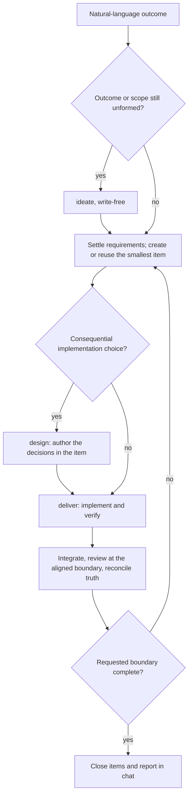

# Work

Carry the user's natural-language outcome to its requested finish line. Keep one
continuous conversation and one outcome owner. Skills supply capabilities, not
stages the user or agent must repeatedly enter and leave.

Epics coordinate and always have feature children. Features may stand alone;
stories may also stand alone for small bugs or small items. Split large features
into child stories during design, implementation, or review follow-up; keep work in
those children, not one parent file. Completion cleanup is mandatory: summarize
or discard per conventions and remove completed active files and attachments.
See [lifecycle](references/lifecycle.md) for the full rules.

## Start from current truth

Confirm that an upward-found `.work/CONVENTIONS.md` declares `owner: workbench`.
Otherwise handle the request without Workbench. Do not offer setup unless the
user asks to adopt or initialize it.

Read conventions, project instructions, relevant items, foundations, and affected
code. Use `.knowledge/index.json` when present to discover relevant truth, not
as a reason to read every indexed document. Root foundations own repository-wide
truth; scope-owned foundations live at the repository's established location.
Apply [version guidance](../setup/references/version-compatibility.md) before
stateful work. A mismatch is advisory, not consent to run setup.

Load guidance once while it remains available and unchanged in this context.
A skill invocation is not a fresh session: carry forward scope, decisions,
postures, and evidence without another activation or readiness ceremony.
Fresh contexts load their own governing guidance. On resume, reconcile current
items, Git, and affected code rather than trusting stale progress claims.

## Keep the ordinary path continuous

For a clear request:

1. Settle the outcome, meaningful exclusions, and observable acceptance evidence.
2. Create or reuse the smallest useful item, normally one feature.
3. Resolve local choices and implement using [deliver](../deliver/SKILL.md).
4. Verify behavior, reconcile affected truth, and review the coherent result.
5. Close completed work and report the result in chat.

Read delivery guidance when implementation starts, then apply it across ready
units without reloading or reenacting a handoff. For one item, its owner carries
the whole path. For several items, retain wider integration and acceptance here.
Do not repeat checks or review already satisfied at the right boundary.
Apply [review boundaries](references/review-boundaries.md): align optional design
review once for the run and choose adaptive implementation review checkpoints.
Several features or deliveries may share one review-and-fix pass while each unit
receives prompt verification. Keep pending review visible until closure.

Use the current context when it can finish the next piece well. Another context
must offer useful focus, independence, specialization, isolation, or throughput
relative to its handoff cost. This applies to review as much as implementation.
A short review can be a deliberate inline inspection, not an agent assignment.
Follow explicit execution preferences rather than imposing an inline-only rule.

## Resolve authority and uncertainty

Read [autonomy](references/autonomy.md) to resolve decision authority from the
request and conventions. Autonomy never expands scope, quality obligations,
permissions, or authority over production, real data, irreversible, or external
actions. Keep narrow requests narrow. Foundation aspirations are not new work.

Learn discoverable facts before asking the human. Use
[requirements](references/requirements.md) for consequential ambiguity. Ask only
for unsettled product direction, supported behavior, or consequential trade-offs
that the user must decide. Do not ask again merely to enter another capability.
Missing question tooling is not consent to guess.

During stateful work, a directly confirmed, evidence-backed calibration refinement
may replace stale conventions prose. Loose requests only propose that edit unless
the user explicitly authorizes it. Do not turn one incident into a standing rule.

Use [ideate](../ideate/SKILL.md) when the outcome cannot yet form coherent work,
or valuable early exploration could materially reshape a substantial initiative.
Skip that preflight for established mechanical work or explicit direct execution.
Ideation remains write-free until a handoff is selected. For an existing end-to-end
request, resolve bounded implementation uncertainty here rather than restarting
exploration or asking for permission already granted.

Before implementation becomes costly to reverse, assess the unresolved choices:

- **Local implementation detail:** decide, verify, and continue.
- **Changed technical assumption inside scope:** update the affected decision,
  inspect its dependent contracts, and revise only the necessary work and checks.
- **Consequential implementation shape:** use [design](../design/SKILL.md) for
  discovery, alternatives, and any review selected for the run. Keep the same owner and
  accepted context. Revisit the affected decision, not the whole design.
- **Missing product requirement or changed authority:** ask about that commitment.
  Continue independent authorized work when possible.

An item's existence is not proof of design readiness. Conversely, a changed
technical detail does not invalidate every settled decision. Report discoveries
and consequences, not workflow transitions. A direct design or review request
stops at that requested boundary; an end-to-end request continues through it.

## Keep durable work small

Read [lifecycle](references/lifecycle.md) when creating, relating, blocking, or
closing items. Temporary agent assignments do not become ledger items.

Record the outcome, scope, acceptance evidence, and useful continuation context.
The work item is the contract between design, review, and implementation. The
assigned designer authors and revises its design directly. The outcome owner
adjudicates scope and readiness, not a second design handoff. Before dependent
implementation, check that accepted decisions and design corrections are in the
item. Design-agent returns and onward dispatch pass item and attachment references
plus brief supplementary details, not the full design or a reconstruction of it.
The receiving agent reads the recorded contract directly.
Use optional [design attachments](references/design-attachments.md) only when detailed
specifications reduce ambiguity. They remain part of the item's contract and are
always deleted when their owner completes, even when a completion stub is retained.
Omit empty optional metadata and unused sections. Add design, dependencies, or
coordination detail only when the work needs them. Do not reformat existing items
merely to make them shorter. Replace superseded decisions instead of keeping a
conversation transcript.

Use `blocked_by` only for a real prerequisite or when serial work materially
reduces rework, ambiguity, or integration risk. Independent work stays edge-free.
Parentage and shared files do not themselves impose order.

A cleanup or refactor is ordinary bounded work; behavior changes need explicit
requirements. A prototype uses the `prototype` tag and records its question, representative
surface, evidence, and disposition. Carry useful learning to its owning truth,
remove code marked for discard, and treat revision or adoption as a next outcome.

## Coordinate only what needs coordination

For multi-unit work, read [execution](references/execution.md) and
[role handoffs](references/role-handoffs.md). The outcome owner retains integration,
acceptance, shared surfaces, and parent closure even when every unit runs inline.
Delegate only independent work with clear ownership and an integration contract.
Inspect returned changes and evidence; a worker's completion claim is not acceptance.

Use [delivery topology](references/delivery-topology.md) when continuation or
integration complexity needs durable coordination. Prefer an existing owning item
rather than a wrapper. Update the approach when facts change, and keep unrelated
ready work moving when one unit stalls.

For multiple sub-agents, follow
[model alignment](references/execution-posture.md#align-models-before-multi-subagent-execution).
Respect aligned resources and explicit preferences. Routine assignments within
that agreement do not require repeated permission. New consequential commitments
still do. Use [Git posture](references/git-posture.md) for meaningful commit
boundaries, never ledger-transition commits or cosmetic shared-history rewrites.

## Finish the accepted boundary

Apply [deliver](../deliver/SKILL.md)'s verification, reconciliation, review, and
closure rules. Features and standalone stories may share an integrated review
checkpoint. Keep them active until their selected review and acceptance are
satisfied. Nested stories return verified slice evidence to their feature.
Review wider integration only for substantive behavior not already covered.
Returning to the owner does not create another review budget.

Required cohesive cleanup remains in scope. Follow
[maintenance](references/maintenance.md) when stale patterns or credible extraction
candidates arise. Optional learning or extraction requires a selected outcome and
never delays closure. Orchestrated deliverers report shared pattern implications
instead of editing the shared catalog.

Close completed items immediately under the configured retention posture and
validate structural ledger changes. Continue until the full requested boundary is
complete or a concrete external blocker prevents meaningful progress. Before
interruption, preserve settled decisions, useful evidence, next actions, and
blockers in the affected item. Reconcile them against the repository on resume.

Report outcomes, meaningful decisions, verification, limitations, closure, and
selected follow-ups in chat. Do not create report files or no-op records unless
the user requests them. Keep questions, proposals, and progress out of foundations.

## Draw on focused guidance

Load these only when relevant, reusing unchanged guidance already in context:

- runner choice → [execution posture](references/execution-posture.md);
- model and effort proposals → [model tendencies](references/model-tendencies.md);
- any design, implementation, or Workbench review →
  [simplification](references/simplification.md), including project calibration;
- verification and review → [verification](references/verification.md) and
  [review](references/review.md);
- durable project truth → [foundation truth](references/foundation-truth.md);
- durable prose → [writing style](references/writing-style.md);
- backlog organization → [backlog grooming](references/backlog-grooming.md);
- UI or journey uncertainty → [UI/UX](references/ui-ux.md);
- opportunities without remediation → [scan](../scan/SKILL.md);
- useful out-of-scope findings selected for retention → [park](../park/SKILL.md);
- substantive external evidence → an available `research` skill. Without one,
  disclose the limitation and keep ordinary source lookup conversational.

Loose reviews and explanations stay read-only unless change is requested. Apply
project calibration without ledger, review-weight, formal packet, or closure
mechanics. Do not turn an adjacent idea into an acceptance requirement.
