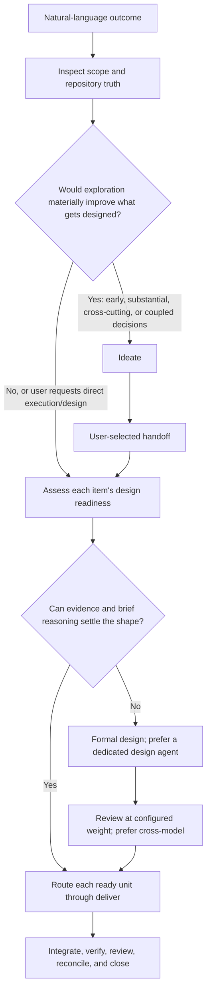

# Work

Carry the user's natural-language boundary to its requested finish line. Never
require them to choose a phase, worker topology, or workflow skill.

## Confirm activation

First confirm that an upward-found `.work/CONVENTIONS.md` declares
`owner: workbench`. If it does not, ignore this skill and handle the request
without Workbench; do not offer setup unless the user explicitly asks to adopt
or initialize Workbench.

When active, read `.work/CONVENTIONS.md` and apply
[setup's advisory version-compatibility guidance](../setup/references/version-compatibility.md)
before any stateful action; mention useful upgrade/setup guidance on mismatch
without blocking work. Then read relevant work items,
project instructions, foundation documents, `.knowledge/index.json` when
present, and affected code before structural decisions. Foundation documents
usually live in root `docs/` for repository-wide truth, with sub-project truth
in `<sub-project>/docs/` or `docs/<sub-project>/` following repository
convention.

Unless an instruction names a repository path or artifact, communicate with the
user in the current conversation, including questions, offers, proposals,
recommendations, explanations, summaries, and reports. Do not create report
files or durable no-op records unless the user requests them.

## Routing sketch

Route through `ideate` when the intended outcome, ownership boundary, or basic
success shape is too ambiguous to form coherent work. Also prefer it for the
initial exploration of a substantial new initiative, cross-cutting change, or
early design when a short collaborative pass could materially improve what gets
designed, and when several coupled product, domain, or business decisions
materially reshape one another or the scope. Large size alone is insufficient:
an established mechanical outcome can remain in `work`. Skip the ideation pass
when the user explicitly requests direct design or execution, or existing items
and foundation truth already make exploration unlikely to change the outcome.
Do not create or reshape work items while ideating; resume `work` only after the
user explicitly selects a Workbench handoff.

Load references only as needed:

- every substantive request and continuation boundary →
  [references/autonomy.md](references/autonomy.md);
- requirements or consequential ambiguity →
  [references/requirements.md](references/requirements.md);
- item creation, relationships, blocking, completion, or summaries →
  [references/lifecycle.md](references/lifecycle.md);
- multi-unit or multi-epic orchestration →
  [references/execution.md](references/execution.md);
- designer, implementor, or reviewer model selection →
  [references/model-roles.md](references/model-roles.md);
- nontrivial UI or journey uncertainty →
  [references/ui-ux.md](references/ui-ux.md);
- every design, implementation, and Workbench review →
  [references/simplification.md](references/simplification.md);
- substantial implementation, refactoring, or recurrence →
  [references/maintenance.md](references/maintenance.md);
- implementation completion or review →
  [references/verification.md](references/verification.md),
  [references/review.md](references/review.md), and
  [references/git-posture.md](references/git-posture.md);
- durable project truth, foundation changes, or implementation completion →
  [references/foundation-truth.md](references/foundation-truth.md);
- durable prose in items, design sections, foundation docs, or release
  summaries →
  [references/writing-style.md](references/writing-style.md).

When substantive external investigation is necessary, use an available
`research` skill. If none is available, explain the degraded mode and limit
current-source lookup to conversational support. Do not create an ungrounded
project note.

## Resolve the requested boundary

Read [references/autonomy.md](references/autonomy.md) and resolve the effective
autonomy posture before deciding when to ask, act, or continue. Autonomy does
not broaden the requested boundary or authorize production, real-data,
irreversible, or external actions.

Keep narrow requests narrow. Treat “finish,” “drive to done,” and “handle end
to end” as instructions to reach the requested finish line, not permission to
invent requirements or enlarge it. Applicable foundation documents constrain
and clarify that outcome; they do not automatically pull adjacent intended work
into the current boundary.

A request to look for problems, investigate a quality concern, scan a project
surface, or propose improvements without starting remediation routes through
`scan`. If the user later selects an opportunity for active work, resume here or
in `design` with that explicit handoff. Use `ideate` instead when the uncertainty
is primarily about what product or project outcome the user wants rather than
what opportunities exist in the current system.

A concrete review of a named Workbench outcome remains read-only. Report the
result in the current conversation and change nothing unless the user also asks
for a change. General code review, explanation, diagnosis, and other loose
requests are not Workbench workflows and do not acquire ledger, closure, or
configured review-weight obligations merely because the repository uses
Workbench.

For an epic, include required children and integration. For several epics,
resolve the complete named target set. For a delivery outcome, discover
necessary work inside that boundary without silently draining unrelated queues.
If the boundary is unclear, ask which items are in scope. A multi-epic request
does not require a synthetic program item.

Keep clarification inside `work` when the outcome is clear and only a small
number of mostly local consequential requirements remain. Large or multi-epic
work stays in `work` when it is established and exploration would not materially
change what gets designed. Use `ideate` for valuable initial exploration even
when a headline request sounds coherent, especially when competing directions
or several coupled human-owned decisions materially reshape one another or the
scope.

## Gather requirements from the human

Learn discoverable facts from the repository and current sources. Gather human
input for product direction, preferences, supported behavior, consequential
trade-offs, or other choices only the user can settle. In collaborative work,
surface ideal states and meaningful alternatives. In adaptive work, ask only
when the answer materially affects the outcome. In autonomous work, treat
settled request language and prior answers as requirements, but still pause for
missing human-only direction. Never treat missing structured-question tooling
as permission to guess or continue.

Record accepted outcomes, constraints, exclusions, and acceptance evidence in
the relevant active item without manufacturing a large template.

## Shape durable work

Use one active item for one coherent outcome. A feature is the default delivery
and integrated review unit. Use an epic only when at least two independently
meaningful feature outcomes can be named. Use a story for a narrow independently
verifiable slice. Create child files only when separate status or cross-session
relationships matter. Temporary agent units belong in an execution approach,
not automatically in `.work/active/`.

Nested hierarchy follows `epic → feature → story` without skipping a tier.
Read [references/lifecycle.md](references/lifecycle.md) before choosing an item
kind or relationship.

Use `blocked_by` when another active item should finish first because serial
work materially reduces rework, ambiguity, or integration risk. Leave
independent work edge-free so it can run in parallel. Explain non-obvious order
in ordinary item prose only when useful. Use `related_to` for non-ordering
context.

A standalone cleanup, simplification, refactor, or pattern-extraction outcome is
normal Workbench work when it has a coherent boundary and observable completion
evidence. Use tags such as `cleanup`, `refactor`, or `pattern`; do not add another
item kind. Split independent subsystems only when their status or verification
can meaningfully diverge. A maintenance feature belongs under the active epic
when that epic owns the large boundary; otherwise it is top-level. Never nest a
feature under another feature.

A prototype is normal Workbench work when its coherent outcome is learning.
Record the decision or assumption it tests, the smallest representative surface,
the evidence needed, and the expected disposition: discard, revise, or adopt.
Tag it `prototype`; do not add another item kind or present exploratory output as
production-ready behavior. Before closing, record what the prototype established
and its disposition. Carry material learning into the foundation or active item
whose future direction it changes. Remove prototype code marked for discard;
revising or adopting it requires an explicit next outcome.

## Execute to the requested finish line

Order work from real prerequisites. For a multi-unit boundary, act as the
outcome owner and orchestrator; for small coherent work, execute directly when
delegation would add no value.

Before implementing or delegating each feature, story, or other coherent unit,
read [references/simplification.md](references/simplification.md), resolve the
effective simplification posture, and apply it within the affected boundary.
Then read the unit's current scope and assess design readiness against the
repository. An item's existence, acceptance criteria, or place in an epic does
not mean its implementation shape has been designed. Keep design inline when
repository evidence and brief reasoning can confidently resolve local,
reversible choices. Route through Workbench's `design` skill when meaningful
discovery, alternatives, boundary definition, or adjudication must be settled
first, and complete its required review before delegation or implementation. Do
not use a size label alone as the gate. A direct user request to design stops
after design, while an end-to-end delivery request resumes implementation
afterward.

Route each ready feature or story through Workbench's `deliver` skill. Resolve
the effective Git posture from explicit user direction, the optional project
convention, then `adaptive`. For one ready item, direct mode lets `deliver` own
item-level implementation, review, reconciliation, and closure. For a wider
boundary, call it in orchestrated mode with the parent outcome, non-overlapping
write surface, integration contract, effective Git posture, and return evidence.
Under `batch`, `work` owns the wider commit boundary; deliverers must not reshape
the wider history independently. Orchestrated deliverers report stale patterns and credible
promotion candidates instead of writing the shared pattern catalog. During a
user-authorized multi-unit boundary, retain candidate evidence in the active
parent's `## Maintenance evidence` section using the fields and disposition
rules from [references/maintenance.md](references/maintenance.md). Do not repeat
a completed feature or standalone-story review; review only substantive wider
integration behavior not covered at those item boundaries.

Research only to the depth needed. Parallelize only genuinely independent units
with clear ownership and integration points.

Inspect actual changes and returned evidence. The orchestrating agent owns
integration, acceptance, and the full requested scope. Do not stop because one
child finished, implementation ended before review, a worker returned, or a
former stage boundary was reached.

Pause when discovered work materially exceeds the requested boundary, requires
a new epic-sized outcome, or reaches an irreversible, production, or real-data
action. Use `park` to capture useful findings outside the current scope with
evidence instead of expanding silently.

Continue until every item in the requested boundary is complete or a concrete
external blocker prevents meaningful progress.

## Verify, review, and close

For the concrete Workbench delivery outcome, verify behavior at stable
interfaces, run required project checks, and exercise meaningful user journeys.
For a user-authorized multi-unit boundary, apply
[references/maintenance.md](references/maintenance.md) at an explicit integration
or planning boundary. Adjudicate every entry in `## Maintenance evidence`. When
concrete recurrence warrants extraction or cohesive cleanup, create the ordinary
maintenance feature at the valid hierarchy level and route it through `deliver`
before the owning epic or wider boundary closes. Offer immature useful evidence
to `park`; remove rejected coincidence. Do not use a fixed item count, periodic
schedule, or smaller delivery as authority to manufacture maintenance work. The
parent cannot close with undisposed maintenance evidence.

Read [references/review.md](references/review.md), resolve the effective
`review_weight` and simplification posture, and apply both to that Workbench
outcome, including the mandatory non-expansion instruction in every review
prompt. Explicit user direction overrides repository defaults. Verify and
adjudicate reviewer findings rather than accepting them blindly; reject invented
requirements and park useful out-of-scope proposals instead of making them
acceptance blockers.

Read [references/foundation-truth.md](references/foundation-truth.md).
Reconcile affected foundation assertions against the integrated result before
completion and apply its altitude test: foundations keep high-level durable
truth while work tracking, implementation plans, qualification mechanics,
receipts, and evidence stay in the work record or their owning executable
surfaces. Rebuild `.knowledge/index.json` when indexed documentation changed,
and include relevant reconciliation evidence in the user-facing completion
reply. Close every completed item immediately:

- `completed_items: summarize` → replace it with a compact completed stub;
- `completed_items: discard` → remove it.

Before closing, remove the completed id from remaining `blocked_by` and
`related_to` lists. A parent cannot close while active children remain. Run
`validate-workbench.py`
after creating, reshaping, or closing ledger items.
Resolve the validator's plugin root using setup's identity-verification rule;
stop rather than guessing among ambiguous installations. Never leave completed
items active.

Before interruption, handoff, or context loss, update affected items with
settled requirements, completed outcomes, current evidence, next actions, and
blockers. On resume, reconcile that state against Git and code before acting.
Workbench item transitions do not require their own commits. Commit and any
safe consolidation follow [references/git-posture.md](references/git-posture.md),
never item-count or stage-transition mechanics.

Reply to the user in the current conversation with a concise completion summary:
completed outcomes, meaningful decisions, verification, closure disposition,
blockers, and intentionally parked follow-ups. This reply is chat prose, not a
repository artifact. Do not create a completion-report file or add reporting
sections to work items or foundation documents unless the user requests them.
