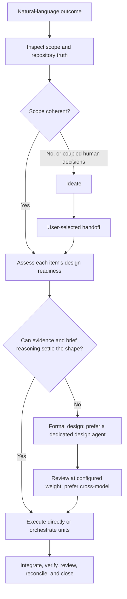

# Work

Carry the user's natural-language boundary to its requested finish line. Never
require them to choose a phase, worker topology, or workflow skill.

## Routing sketch

Unless an instruction names a repository path or artifact, communicate with the
user in the current conversation, including questions, offers, proposals,
recommendations, explanations, summaries, and reports. Do not create report
files or durable no-op records unless the user requests them.

First confirm that an upward-found `.work/CONVENTIONS.md` declares
`owner: workbench`. If it does not, ignore this skill and handle the request
without Workbench; do not offer setup unless the user explicitly asks to adopt
or initialize Workbench.

When active, read `.work/CONVENTIONS.md`, relevant work items, project
instructions, foundation documents, `.knowledge/index.json` when present, and
affected code before structural decisions. Foundation documents generally live
in root `docs/` for repository-wide truth, with sub-project truth in
`<sub-project>/docs/` or `docs/<sub-project>/` following repository convention.

Route through `ideate` when the intended outcome, ownership boundary, or basic
success shape is too ambiguous to form coherent work. Also route there when an
apparently clear request still depends on several coupled product, domain, or
business decisions whose answers materially reshape one another or the scope.
Do not create or reshape work items while ideating; resume `work` only after the
user explicitly selects a Workbench handoff.

Load references only as needed:

- every substantive request and continuation boundary →
  [references/autonomy.md](references/autonomy.md);
- requirements or consequential ambiguity →
  [references/requirements.md](references/requirements.md);
- item creation, relationships, blocking, completion, or summaries →
  [references/lifecycle.md](references/lifecycle.md);
- multi-unit or multi-epic execution →
  [references/execution.md](references/execution.md);
- nontrivial UI or journey uncertainty →
  [references/ui-ux.md](references/ui-ux.md);
- substantial implementation, refactoring, or recurrence →
  [references/maintenance.md](references/maintenance.md);
- implementation completion or review →
  [references/verification.md](references/verification.md) and
  [references/review.md](references/review.md);
- durable project truth, foundation changes, or implementation completion →
  [references/foundation-truth.md](references/foundation-truth.md);
- durable prose in items, design sections, foundation docs, or release
  summaries →
  [references/writing-style.md](references/writing-style.md).

When substantive external investigation is necessary, use an available
`research` skill. If none is available, explain the degraded mode and limit
current-source lookup to conversational support. Do not create an ungrounded
project note.

## Resolve the requested boundary

Read [references/autonomy.md](references/autonomy.md) and resolve the effective
autonomy posture before deciding when to ask, act, or continue. Autonomy does
not broaden the requested boundary or authorize production, real-data,
irreversible, or external actions.

Keep narrow requests narrow. Treat “finish,” “drive to done,” and “handle end
to end” as instructions to reach the requested finish line, not permission to
invent requirements or enlarge it. Applicable foundation documents constrain
and clarify that outcome; they do not automatically pull adjacent intended work
into the current boundary.

A concrete review or audit of a named Workbench outcome remains read-only.
Report the result in the current conversation and change nothing unless the
user also asks for a change. General code review, explanation, diagnosis, and
other loose requests are not Workbench workflows and do not acquire ledger,
closure, or configured review-weight obligations merely because the repository
uses Workbench.

For an epic, include required children and integration. For several epics,
resolve the complete named target set. For a delivery outcome, discover
necessary work inside that boundary without silently draining unrelated queues.
If the boundary is unclear, ask which items are in scope. A multi-epic request
does not require a synthetic program item.

Keep clarification inside `work` when the outcome is clear and only a small
number of mostly local consequential requirements remain. Large or multi-epic
work stays in `work` when it is already coherent. Use `ideate` when selecting
the outcome or boundary requires collaborative exploration, or when competing
directions or several coupled human-owned decisions materially reshape one
another or the scope.

## Gather requirements from the human

Learn discoverable facts from the repository and current sources. Gather human
input for product direction, preferences, supported behavior, consequential
trade-offs, or other choices only the user can settle. In collaborative work,
surface ideal states and meaningful alternatives. In adaptive work, ask only
when the answer materially affects the outcome. In autonomous work, treat
settled request language and prior answers as requirements, but still pause for
missing human-only direction. Never treat missing structured-question tooling
as permission to guess or continue.

Record accepted outcomes, constraints, exclusions, and acceptance evidence in
the relevant active item without manufacturing a large template.

## Shape durable work

Use one active item for one coherent outcome. A feature is the default delivery
and integrated review unit. Use an epic only when at least two independently
meaningful feature outcomes can be named. Use a story for a narrow independently
verifiable slice. Create child files only when separate status or cross-session
relationships matter. Temporary agent units belong in an execution approach,
not automatically in `.work/active/`.

Nested hierarchy follows `epic → feature → story` without skipping a tier.
Read [references/lifecycle.md](references/lifecycle.md) before choosing an item
kind or relationship.

Use `blocked_by` when another active item should finish first because serial
work materially reduces rework, ambiguity, or integration risk. Record one
reason per edge in `## Sequencing`. Leave independent work edge-free so it can
run in parallel. Use `related_to` for non-ordering context.

A standalone cleanup, simplification, or refactor is normal Workbench work when
it has a coherent boundary and observable completion evidence. Use tags such as
`cleanup` or `refactor`; do not add another item kind. Split independent
subsystems only when their status or verification can meaningfully diverge.

A prototype is normal Workbench work when its coherent outcome is learning.
Record the decision or assumption it tests, the smallest representative surface,
the evidence needed, and the expected disposition: discard, revise, or adopt.
Tag it `prototype`; do not add another item kind or present exploratory output as
production-ready behavior. Before closing, record what the prototype established
and its disposition. Carry material learning into the foundation or active item
whose future direction it changes. Remove prototype code marked for discard;
revising or adopting it requires an explicit next outcome.

## Execute to the requested finish line

Order work from real prerequisites. For a multi-unit boundary, act as the
outcome owner and orchestrator; for small coherent work, execute directly when
delegation would add no value.

Before implementing or delegating each feature, story, or other coherent unit,
read its current scope and assess design readiness against the repository. An
item's existence, acceptance criteria, or place in an epic does not mean its
implementation shape has been designed. Keep design inline when repository
evidence and brief reasoning can confidently resolve local, reversible choices.
Route through Workbench's `design` skill when meaningful discovery,
alternatives, boundary definition, or adjudication must be settled first, and
complete its required review before delegation or implementation. Do not use a
size label alone as the gate. A direct user request to design stops after design,
while an end-to-end delivery request resumes implementation afterward.

Research only to the depth needed. Parallelize only genuinely independent units
with clear ownership and integration points.

Inspect actual changes and returned evidence. The orchestrating agent owns
integration, acceptance, and the full requested scope. Do not stop because one
child finished, implementation ended before review, a worker returned, or a
former stage boundary was reached.

Pause when discovered work materially exceeds the requested boundary, requires
a new epic-sized outcome, or reaches an irreversible, production, or real-data
action. Use `park` to capture useful findings outside the current scope with
evidence instead of expanding silently.

Continue until every item in the requested boundary is complete or a concrete
external blocker prevents meaningful progress.

## Verify, review, and close

For the concrete Workbench delivery outcome, verify behavior at stable
interfaces, run required project checks, and exercise meaningful user journeys.
Read [references/review.md](references/review.md), resolve the effective
`review_weight`, and apply its implementation-review policy to that Workbench
outcome, including the mandatory non-expansion instruction in every review
prompt. An explicit user request overrides the repository default. Verify and
adjudicate reviewer findings rather than accepting them blindly; reject invented
requirements and park useful out-of-scope proposals instead of making them
acceptance blockers.

Read [references/foundation-truth.md](references/foundation-truth.md).
Reconcile affected foundation assertions against the integrated result before
completion, rebuild `.knowledge/index.json` when indexed documentation changed,
and include relevant reconciliation evidence in the user-facing completion
reply. Close every completed item immediately:

- `completed_items: summarize` → replace it with a compact completed stub;
- `completed_items: discard` → remove it.

Before closing, remove the completed id from remaining `blocked_by` and
`related_to` lists and remove its matching sequencing entry in the same edit. A
parent cannot close while active children remain. Run `validate-workbench.py`
after creating, reshaping, or closing ledger items.
Resolve it from the loaded Workbench plugin package using setup's
identity-verification rule; stop rather than guessing among ambiguous
installations. Never leave completed items active.

Before interruption, handoff, or context loss, update affected items with
settled requirements, completed outcomes, current evidence, next actions, and
blockers. On resume, reconcile that state against Git and code before acting.

Reply to the user in the current conversation with a concise completion summary:
completed outcomes, meaningful decisions, verification, closure disposition,
blockers, and intentionally parked follow-ups. This reply is chat prose, not a
repository artifact. Do not create a completion-report file or add reporting
sections to work items or foundation documents unless the user requests them.
